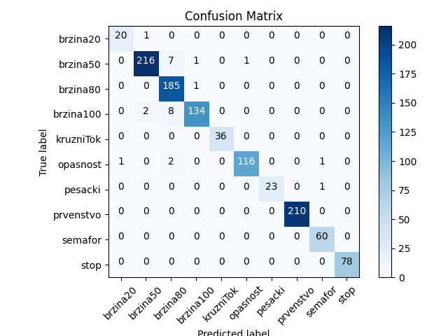
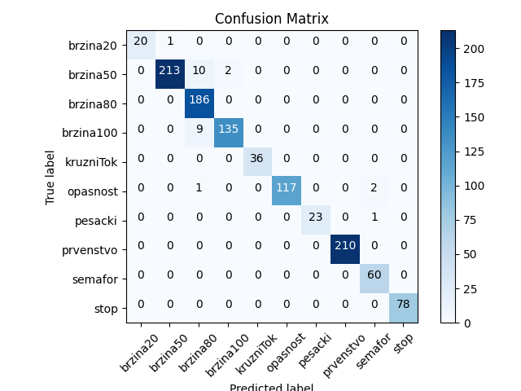

# Traffic Sign Recognition using Convolutional Neural Networks

This project was completed as part of the **Neuronske Mreže** class at the Faculty of Sciences, University of Novi Sad in the second year of my studies. The project uses a convolutional neural network (CNN) to recognize different traffic signs. The model is trained on a dataset of images and evaluated on a test set.

## Dataset

The original dataset consisted of a large number of images. These were split into three sets:

- **Training set**: used to train the model (around 60% of the dataset)
- **Validation set**: used to evaluate the model's performance during training (around 20% of the dataset)
- **Test set**: used to evaluate the final performance of the model (around 20% of the dataset)

## Model Architecture

The model consists of several convolutional layers, followed by an AveragePooling2D layer, and a final dense layer with a softmax activation function. The specific architecture is as follows:

1. **Convolutional layer** with ReLU activation function
2. **AveragePooling2D layer**
3. **Dense layer** with Sigmoid activation function

## Activation Functions

I experimented with two different activation functions:

- **ReLU** (Rectified Linear Unit) in the convolutional layer
- **Sigmoid** in the dense layer

### Results with Different Activation Functions

#### ReLU Activation Function
- ReLU was used in the convolutional layer, and no activation function was applied to the dense layer.
- Results: 

#### No Activation Function
- No activation function was applied to either the convolutional layer or the dense layer.
- Results: 

#### Sigmoid Activation Function
- Sigmoid was used in the dense layer, and no activation function was applied to the convolutional layer.
- Results: 

## Training and Evaluation

The model was trained on the training set for **20 epochs**, with a batch size of **32**. After each epoch, the model was evaluated on the validation set and the accuracy was printed. The model was trained **10 times**, and the **average accuracy** was calculated.

## Code Organization

The code is organized into several modules:

- **PictureOrganisation**: Contains functions for organizing the pictures in the data directory
- **ConfusionMatrixPlot**: Contains functions for plotting the confusion matrix
- **Main**: Contains the main code for training and evaluating the model

## Requirements

- Python 3.x
- Keras
- TensorFlow
- NumPy
- Matplotlib
